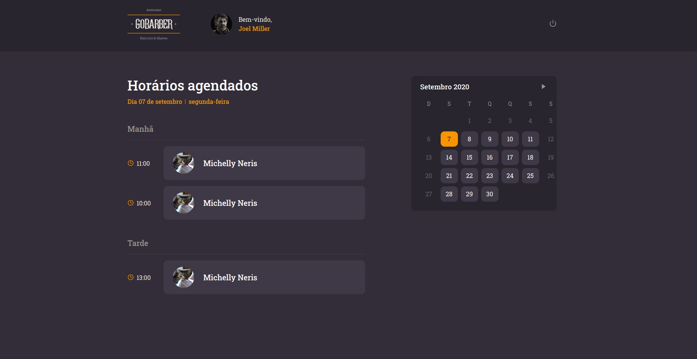

# GoBarber

A fullstack application that allows people to provide haircuts on the web version, and to schedule haircuts on the mobile version.

_Server_

- Made with TypeScript, Node, Express, PostgreSQL, MongoDB, Redis, TypeORM

A server built following the REST principles.

_Web Frontend_

- Made with React: React Hooks, Styled Components

On the web version the user can create an account, login/logout, and see all haircut appointments according to day, month, year.

_Mobile App_

- Made with React Native: React Hooks, Styled Components

On the mobile version the user can create an account, login/logout, list all providers, and create haircut appointments.

---

Project made during the GoStack bootcamp
